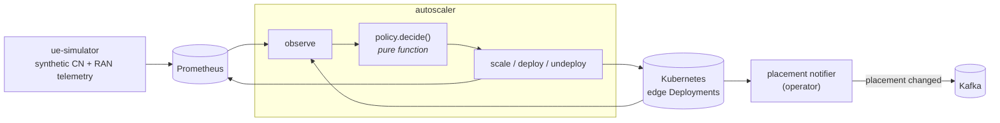

# RAN-aware Edge Autoscaling

Autoscalers watch CPU. By the time CPU rises the load has already arrived, the
replicas are already struggling, and the users are already seeing it.

The radio network knows earlier. A handset attaches to a cell before it
generates application traffic, and the cell reports both the attachment and the
bitrate. **This scales edge workloads on that signal instead** — deploying an
application when users appear at an edge node, sizing it to the radio traffic
those users are generating, and removing it when the cells drain.

It uses **both** halves the network can tell you, and they answer different
questions:

- **Core network** — how many subscriber sessions are attached at an edge
  node. Derived from the SMF plus the application backend. This decides
  whether the application needs to run there *at all*.
- **RAN** — the aggregated radio traffic those users are generating. This
  decides *how big* it needs to be.

Built for the **6G-OASIS** project at Nearby Computing, implementing the NASO
framework from *Exploiting 6G RAN and Core Network Information for Intelligent
Edge-Cloud Service Orchestration* (EuCNC/6G Summit 2025) —
[doi:10.1109/EuCNC/6GSummit63408.2025.11037032](https://doi.org/10.1109/EuCNC/6GSummit63408.2025.11037032).

## See it work, without a cluster

```bash
pip install -r requirements.txt
python -m autoscaler.demo
```

```
phase       edge    users    Mbps  replicas  action
--------------------------------------------------
ramp-up     edge1       5      29         1  deploy
ramp-up     edge1      18     106         3  scale
ramp-up     edge1      43     254         6  scale
ramp-up     edge1      57     323         7  scale
ramp-down   edge1      25     149         3  scale
ramp-down   edge1       0       0         0  undeploy
```

No Kubernetes, no Prometheus. The telemetry source runs in-process and the
policy drives an in-memory stand-in for the Deployment.

## How it fits together



| | |
| --- | --- |
| [`autoscaler/`](autoscaler/) | The control loop, with the decision isolated as a pure function |
| [`ue_simulator/`](ue_simulator/) | RAN telemetry source — you cannot get real radio metrics on a laptop |
| [`operator/`](operator/) | Go operator: app moves edge node → exactly one Kafka event |
| [`studies/`](studies/) | The offline evaluation behind the paper |
| [`charts/`](charts/) · [`docker/`](docker/) · [`grafana/`](grafana/) | Deployment |

## The decision

The whole algorithm is one pure function —
[`policy.decide()`](autoscaler/policy.py). It takes an observation and returns
a decision, with no I/O, and it is Algorithm 1 of the paper:

| Paper | Signal | Here |
| --- | --- | --- |
| **HSIA** — Horizontal Service Instance Autoscaler | active user sessions (**CN**) | the `deploy` / `undeploy` branch |
| **HSRA** — Horizontal Service Resource Autoscaler | aggregated radio traffic (**RAN**) | the `scale` branch, `R = ⌈T / T_opt⌉` (Eq. 1) |
| **HSECM** — Horizontal Service Edge-Cloud Migration | edge CPU capacity | **not implemented** — see limitations |

**Sessions decide whether, traffic decides how much.** No attached users at an
edge node means the application should not run there. Users present means it
should, sized to `ceil(traffic / optimal_traffic_per_replica)` within the SLA
bounds.

Keeping it pure is what lets every branch be tested without a cluster or a
metrics backend, and lets the algorithm be read against the paper without
tracing through retry logic.

## Failure behaviour, stated up front

**An unreachable Prometheus means do nothing that tick.** Zero users means
"undeploy" — so if a failed scrape returned zero instead of raising, one
monitoring hiccup would tear down every workload in the zone. The query raises;
the loop holds; a test fails if that regresses.

**Undeploy means scale to zero, not delete.** It frees the pods without
removing an object the loop did not create. The RBAC role grants no `delete`
verb, so it could not do otherwise.

**One broken edge does not freeze the others.** A failed apply is counted,
logged, and the loop continues to the next edge node.

## Deploying

```bash
helm install ran-telemetry charts/ue-simulator
helm install ran-autoscaler charts/autoscaler \
  --set prometheus.url=http://prometheus.monitoring.svc.cluster.local:9090 \
  --set sla.optimalTrafficMbps=50 \
  --set loop.dryRun=true
```

Start with `dryRun=true`: the loop decides and exports everything but writes
nothing, so you can compare `ran_autoscaler_desired_replicas` against
`ran_autoscaler_current_replicas` before it touches a workload. Full notes in
[`docs/deployment.md`](docs/deployment.md).

## Reproducing the paper

```bash
pip install -r requirements-plot.txt
python -m studies.migration_impact --output-dir out
python studies/energy_efficiency.py
```

```
Random-SM            mean UASM @100Mbps:  43.2%
CPU-based-High-SM    mean UASM @100Mbps:  40.5%
NASO                 mean UASM @100Mbps:  33.6%
```

CPU-based placement is blind to where traffic actually is, so it relocates
services in ways that break more sessions than necessary. Details, and what is
*not* reproducible here, in [`docs/reproducing.md`](docs/reproducing.md).

## Known limitations

- **HSECM is not implemented.** The paper's third mechanism offloads services
  to the cloud when an edge node exceeds its CPU capacity, choosing victims by
  fewest users then highest CPU. This repository covers HSIA and HSRA only;
  [`operator/`](operator/) announces a placement change but does not decide
  one.
- **The loop reacts; it does not predict.** Session and radio metrics move
  before CPU does, which buys a head start — not foresight.
- **Replicas can oscillate at a boundary.** Visible in the demo: 7, 6, 7.
  `deadband` suppresses it and defaults to 0, because 0 is what the paper
  evaluated.
- **Telemetry is synthetic.** The simulator is a stand-in for a network
  exposure function or RIC, not a traffic model taken from measurement.
- **The live loop is an independent implementation.** The original deployment
  realised this algorithm inside a commercial orchestration platform, which is
  proprietary and out of scope. Same algorithm; not the same system.
- **Scaling and migration are not coordinated.** The autoscaler sizes; the
  operator announces moves. Nothing arbitrates between them.
- **Single replica, no leader election** on the autoscaler. Two would fight.

## Licence and attribution

[Apache-2.0](LICENSE). Copyright 2026 Nearby Computing S.L.; released by
Nearby Computing as a 6G-OASIS project deliverable. See [`NOTICE`](NOTICE).

The paper is joint work with colleagues at Nearby Computing and the Centre
Tecnològic de Telecomunicacions de Catalunya (CTTC). It was supported in part
by the Horizon Europe SNS JU **UNITY-6G** project (European Commission,
ID 101192650) and the **6G-OASIS** project (TSI-063000-2021-24) under the
UNICO5G-RPTR programme.

If you use this work, please cite:

> M. Dalgitsis, G. M. Kibalya, M. A. Serrano, J. Serra and A. Antonopoulos,
> "Exploiting 6G RAN and Core Network Information for Intelligent Edge-Cloud
> Service Orchestration," *EuCNC/6G Summit*, 2025, pp. 369–374,
> doi: 10.1109/EuCNC/6GSummit63408.2025.11037032.
