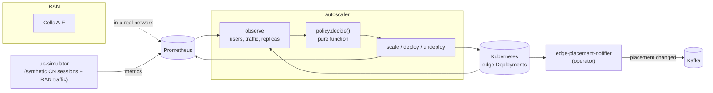
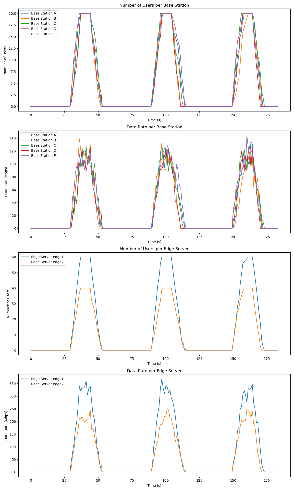
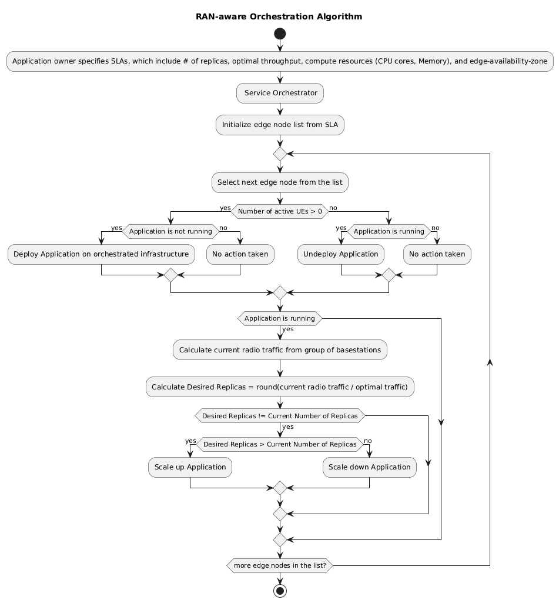

# Architecture

## Why network metrics, and which ones

A conventional autoscaler watches CPU. By the time CPU rises, the load has
already arrived, the replicas are already struggling, and the users are already
seeing it. At the edge this is worse than in a datacentre: sites are small, so
there is less headroom to absorb the lag, and the workload may need *deploying*
first, not merely scaling.

The mobile network knows earlier, and it knows two different things:

**The core network knows who is attached.** Subscriber sessions are visible in
the SMF before those users generate any application traffic. That answers a
question CPU cannot: should this application exist at this edge node at all?
An edge node with no attached sessions should not be running it.

**The RAN knows how much is flowing.** Aggregated bitrate per cell says how
much capacity the attached users actually need right now, which sizes the
deployment.

Using only one of the two collapses the design. Traffic alone cannot tell you
to undeploy — idle traffic and no users look identical. Sessions alone cannot
tell you how many replicas to run.

It is a head start, not prediction. The loop still reacts; it just reacts to
something that moves sooner than CPU.

## The pieces



Four components, each usable on its own:

| | |
| --- | --- |
| [`ue_simulator/`](../ue_simulator) | Generates both signals — session counts and radio traffic — because you have neither a core nor a radio on a laptop. Idle → ramp-up → ramp-down, repeating. |

A cycle of the telemetry source, five cells across two edge nodes:



| [`autoscaler/`](../autoscaler) | The control loop. Reads the signals, decides, applies. |
| [`operator/`](../operator) | Kubernetes operator: when an application's edge placement changes, emit a Kafka event exactly once. |
| [`studies/`](../studies) | The offline evaluation behind the paper. |

## The algorithm



Per edge node, per tick: if there are no active users, undeploy. If there are
users and nothing is running, deploy. If it is running, size it to the radio
traffic and scale if that differs from what is there.

## The decision, isolated

Everything that can fail — Prometheus, the Kubernetes API — is kept out of the
decision. [`policy.decide()`](../autoscaler/policy.py) takes an `Observation`
and returns a `Decision`, with no I/O at all:

```
Observation(edge_node, active_users, data_rate_mbps, deployed, current_replicas)
        │
        ▼
   decide(sla)                    ← pure; the paper's algorithm, readable as one function
        │
        ▼
Decision(action, target_replicas, reason)
```

The rule: **presence drives deployment, traffic drives scale.** No users on an
edge node means the application should not be running there at all. Users
present means it should be running, sized to
`ceil(traffic / optimal_traffic_per_replica)`, clamped to the SLA bounds.

Because the function is pure, every branch is covered by tests that need
neither a cluster nor a metrics backend, and the algorithm can be read against
the paper without tracing through retry logic.

## Failure behaviour is a design decision, not an afterthought

**An unreachable Prometheus means do nothing.** Zero users means "undeploy".
If a failed scrape returned zero instead of raising, one monitoring hiccup
would tear down every workload in the availability zone. So
[`prometheus.py`](../autoscaler/prometheus.py) raises rather than returning an
empty result, and the loop holds position for that tick. There is a test that
fails if this regresses.

**One broken edge node does not freeze the others.** A failed apply is counted
and logged, and the loop moves to the next edge. A single unreachable
Deployment should not stop scaling across the zone.

**Undeploy means scale to zero, not delete.** That frees the pods — the part
that matters for edge resources — while leaving the Deployment in place, so the
loop never deletes an object it did not create. The RBAC role grants no
`delete` verb at all, so it could not even if the logic were wrong.

## What it exports

A controller that acts on metrics but exports none of its own cannot be
debugged: you can see the input and the cluster, but not the decision that
connected them.

| Series | |
| --- | --- |
| `ran_autoscaler_observed_users` / `_observed_traffic_mbps` | What the policy saw (core sessions, radio traffic) |
| `ran_autoscaler_desired_replicas` | What it asked for |
| `ran_autoscaler_current_replicas` | What was there |
| `ran_autoscaler_actions_total` | Decisions, by action |
| `ran_autoscaler_reconcile_errors_total` | Failures, by cause |

Desired against current is the useful pair: a persistent gap means the loop is
deciding correctly and the cluster is not complying, which is a different
problem from deciding badly.

## The migration notifier

Scaling handles *how many*. Migration handles *where* — and when an application
moves between edge nodes, something usually has to be told: a client holding a
session, a gateway, a downstream service.

The [operator](../operator) watches `EdgeAppPlacement` resources and emits a
Kafka event when `spec.edgeNodeId` diverges from
`status.lastNotifiedEdgeNodeId`. Comparing spec against status is what makes it
**exactly-once**: a notification already sent is recorded, and a reconcile that
re-runs for any other reason does not re-announce a migration that already
happened.
